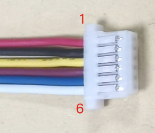
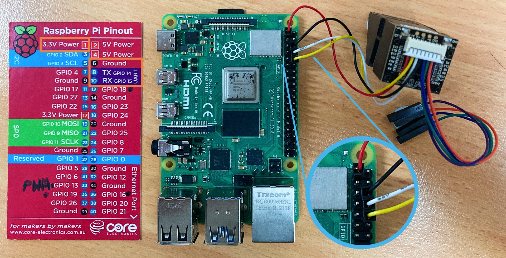
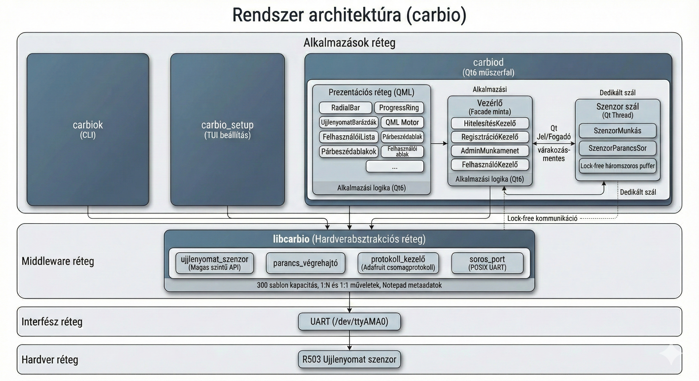
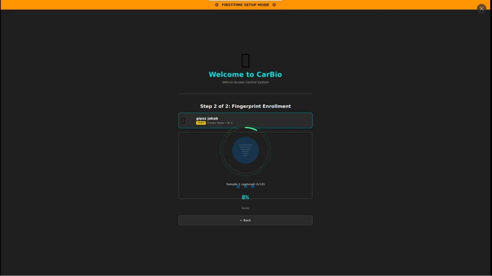
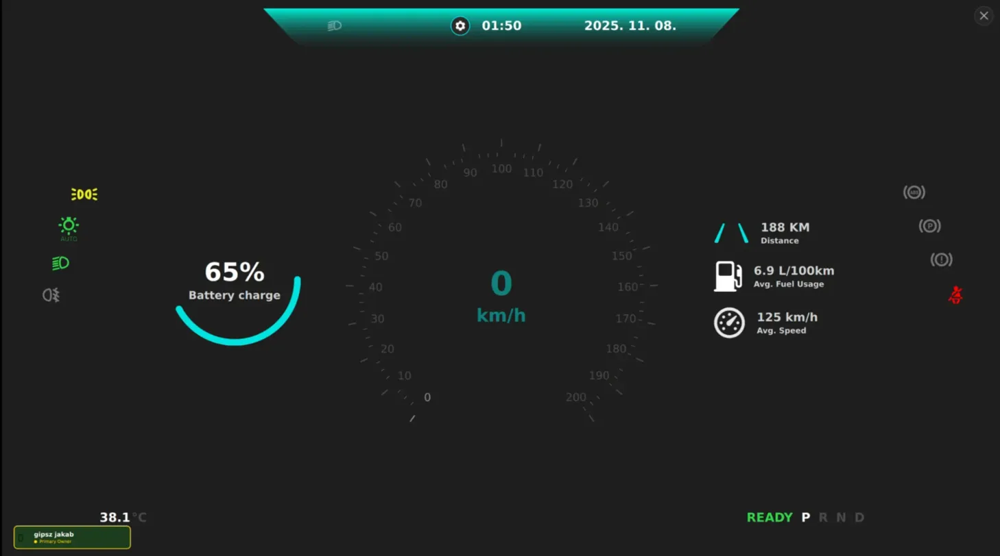

# Car Biometrics (CARBIO)

 Fingerprint-based vehicle access control system for Raspberry Pi. Includes a C++ library (`libcarbio`), CLI tools, and a Qt6 dashboard with role-based access control.

## Motivation

Traditional vehicle key fobs are vulnerable to relay attacks and theft. This project implements biometric authentication as an alternative, with:
  - Hardware abstraction for R503-compatible fingerprint sensors
  - Role-based access control (6 roles, 10 permissions)
  - Security-hardened builds (stack protection, bounds checking, FORTIFY_SOURCE)

## Hardware Connection





**Sensor:** R503 capacitive fingerprint module (or compatible: Adafruit ID751, R503-RGB)

**Wiring (6-pin JST connector):**

| Wire Color | Sensor Pin | Connect To | RPi GPIO |
|------------|------------|------------|----------|
| Red | VCC | 5V | Pin 4 |
| Black | GND | Ground | Pin 6 |
| Yellow | TXD | UART RX | GPIO 15 (Pin 10) |
| Green | RXD | UART TX | GPIO 14 (Pin 8) |
| Blue | WAKEUP | Not used | - |
| White | 3.3V Touch | Not used | - |

> **Note:** Sensor runs on 5V but uses 3.3V logic levels. Direct connection to Pi is safe.

## System Architecture



The project consists of four main components:

```
src/
├── hal/       # Hardware Abstraction Layer (carbio library)
├── cli/       # Command-line sensor tool - exposes fingerprint API (carbiok)
├── setup/     # Interactive fingerprint sensor setup tool (carbio_setup)
└── gui/       # Qt6 QML graphical interface (carbiod) - Dashboard simulation
```

---

## Components

### 1. HAL - Hardware Abstraction Layer (`src/hal/`)

Static library (`libcarbio`) implementing the R503 fingerprint sensor protocol over UART.

**Supported Hardware:**
- R503 capacitive fingerprint sensor (and compatible: ID751, R503-RGB)
- Communication: UART 57600 baud, 8N1
- Template capacity: 200 fingerprints (sensor-dependent)

**Protocol Implementation:**
- Binary packet protocol with 2-byte header, 4-byte address, checksum validation
- Command/ACK model with configurable timeouts
- Supports image capture, feature extraction, template storage, 1:1 matching, 1:N search

**Key Classes:**
| Class | Purpose |
|-------|---------|
| `fingerprint_sensor` | High-level API (connect, enroll, verify, identify) |
| `protocol_handler` | Packet framing, checksum, send/receive |
| `serial_port` | POSIX serial I/O with RAII handle management |
| `result<T>` | Error handling (status code + optional value) |

**Dependencies:** `spdlog` (header-only logging)

**API Usage Example:**
```cpp
#include <carbio/fingerprint_sensor.h>

carbio::fingerprint_sensor sensor;

// Connect to sensor
if (!sensor.connect("/dev/ttyAMA0")) {
    return -1;
}

// Enroll fingerprint at slot 0 with 12 samples
auto result = sensor.enroll(0, 12);
if (!result) {
    std::cerr << "Enroll failed: " << result.error_message() << '\n';
}

// Identify (1:N search with 2s timeout)
auto id_result = sensor.identify(std::chrono::milliseconds(2000));
if (id_result) {
    std::cout << "Matched ID: " << id_result->page_id
              << " Score: " << id_result->match_score << '\n';
}

sensor.disconnect();
```

---

### 2. CLI Tool (`src/cli/`)

Command-line interface tool (`carbiok`) for direct sensor operations using gflags.

**Executable:** `carbiok`

**Features:**
- Low-level operations: capture, extract, merge, store, load, download, upload
- Database operations: search, fast_search, match, erase, clear
- High-level operations: enroll, verify, identify
- Template file import/export
- LED control
- Configurable timeout and sample count

**Usage examples:**
```bash
# Enroll fingerprint at position 5
carbiok --port /dev/ttyAMA0 --enroll --id 5 --samples 12

# Verify against stored template
carbiok --verify --id 5 --timeout 3000

# Identify (search database)
carbiok --identify

# Export template to file
carbiok --export --id 5 --file template.bin

# Import template from file
carbiok --import --id 10 --file template.bin

# Get template count
carbiok --get_count

# LED control
carbiok --led 1   # Turn on
carbiok --led 0   # Turn off
```

**Dependencies:** `carbio` library, `gflags`

---

### 3. Setup Utility (`src/setup/`)

Interactive terminal-based setup utility (`carbio_setup`) with menu-driven interface.

**Executable:** `carbio_setup`

**Menus:**
- **Main Menu** (`main_menu.cpp`) - Primary navigation
- **Enroll Menu** (`enroll_menu.cpp`) - Fingerprint enrollment
- **Verify Menu** (`verify_menu.cpp`) - 1:1 verification
- **Identify Menu** (`identify_menu.cpp`) - 1:N identification
- **Delete Menu** (`delete_menu.cpp`) - Template deletion
- **Clear Menu** (`clear_menu.cpp`) - Database clearing
- **Device Config Menu** (`device_config_menu.cpp`) - Sensor settings
- **LED Config Menu** (`led_config_menu.cpp`) - LED configuration

**Dependencies:** `carbio` library

---

### 4. GUI Application (`src/gui/`)



Qt6 QML graphical dashboard for vehicle biometric authentication.

**Executable:** `carbiod` (named for "carbio dashboard", not daemon)

**Core Components:**
- **`controller.h/.cpp`** - Main controller coordinating all components
- **`authentication_manager.h/.cpp`** - Authentication state machine
  - States: Off → Scanning → Authenticating → Alert → On
  - Lockout management (3 attempts, 20 second lockout)
- **`enrollment_manager.h/.cpp`** - Fingerprint enrollment management
- **`user_manager.h/.cpp`** - User template management (Qt model)
- **`admin_session.h/.cpp`** - Admin session management
- **`sensor_worker.h/.cpp`** - Background sensor thread
- **`template_metadata.h/.cpp`** - Template metadata storage
- **`notepad_metadata.h/.cpp`** - Sensor notepad data persistence
- **`radialbar.h/.cpp`** - Custom radial progress bar widget



**Role-Based Access Control (RBAC):**

| Permission | R1 Primary | R2 Secondary | R3 Family | R4 Restricted | R5 Passenger | R6 Service |
|------------|:----------:|:------------:|:---------:|:-------------:|:------------:|:----------:|
| Vehicle Unlock | ✓ | ✓ | ✓ | ✓ | | |
| Engine Start | ✓ | ✓ | ✓ | ✓* | | |
| Climate Control | ✓ | ✓ | ✓ | ✓ | ✓ | |
| Infotainment | ✓ | ✓ | ✓ | ✓ | ✓ | |
| Admin Access | ✓ | ✓ | | | | |
| Enroll Fingerprint | ✓ | ✓ | | | | |
| Delete Fingerprint | ✓ | ✓ | | | | |
| View Audit Log | ✓ | ✓ | | | | ✓ |
| Export Audit Log | ✓ | | | | | |
| Diagnostic Access | ✓ | | | | | ✓ |

*R4 (Restricted Driver) has time-based constraints (configurable schedule)

**QML UI Components (`qml/`):**
- **Main:** `main.qml` - Dashboard layout
- **Dialogs:**
  - `AuthPrompt.qml` - Authentication prompt
  - `EnrollDialog.qml` - Enrollment dialog
  - `VerifyDialog.qml` - Verification dialog
  - `DeleteDialog.qml` - Delete confirmation
  - `FingerprintSetupDialog.qml` - Fingerprint setup
  - `FirstBootSetupWizard.qml` - Initial setup wizard
  - `AdminFingerprintDialog.qml` - Admin authentication
  - `SystemConfigDialog.qml` - System configuration
  - `LEDControlDialog.qml` - LED settings
  - And more...

- **Components (`components/`):**
  - **Atoms:** `CheckmarkCanvas`, `CountdownTimer`, `FingerprintRidges`, `LockIcon`, `ProgressCanvas`, `StatusDot`, `XMarkCanvas`
  - **Composites:** `AuthProgress`, `FeedbackDisplay`, `FingerprintScanner`, `LockoutDisplay`

**Resources (`res/`):** SVG icons, PNG images for dashboard UI

**Dependencies:** `carbio` library, `Qt6::Core`, `Qt6::Gui`, `Qt6::Qml`, `Qt6::Quick`

---

## Installation

### Prerequisites

**Required:**
- C++23 compatible compiler (GCC 12+, Clang 15+)
- CMake >= 3.23 (for CMake Presets support)
- Ninja build system
- Conan 2.x package manager
- Qt 6 (for GUI only)

**Raspberry Pi specific:**
- Enable UART: Add `enable_uart=1` to `/boot/config.txt`
- Disable serial console: `sudo raspi-config` → Interface Options → Serial Port → No login shell, Yes hardware
- Connect sensor to `/dev/ttyAMA0` (GPIO 14/15)
- Add user to dialout group for serial port access: `sudo usermod -aG dialout $USER` (logout required)

### Install Dependencies

```bash
# Install build tools
sudo apt install ninja-build ccache

# Install Conan
pip install conan

# Configure Conan profile (first time only)
conan profile detect

# Install project dependencies
conan install . --build=missing
```

### Qt 6 Installation (for GUI)

**Raspberry Pi OS:**
```bash
sudo apt install qt6-base-dev qt6-declarative-dev qml6-module-qtquick \
                 qml6-module-qtquick-controls qml6-module-qtquick-layouts
```

**Other Linux:**
```bash
# Ubuntu/Debian
sudo apt install qt6-base-dev qt6-declarative-dev

# Fedora
sudo dnf install qt6-qtbase-devel qt6-qtdeclarative-devel
```

---

## CMake Directory Structure

```
cmake/
├── Init.cmake                    # Main initialization (includes all modules)
├── Modules/
│   ├── CCache.cmake              # ccache detection and setup
│   ├── CPack.cmake               # Packaging configuration (TGZ/ZIP)
│   └── Paths.cmake               # Search paths and output directories
└── Toolchains/
    ├── toolchain-gcc.cmake       # GCC toolchain configuration
    └── overrides-gcc.cmake       # GCC compiler flags and build types
```

### Toolchain Features

The GCC toolchain (`cmake/Toolchains/toolchain-gcc.cmake`) provides:

- **Automatic CPU detection** for parallel builds
- **Raspberry Pi optimization** (reduced parallelism for older models)
- **Unity builds** for faster compilation
- **Ninja job pools** (parallel compile, sequential link)

### Build Types

| Build Type | Description |
|------------|-------------|
| `Debug` | Debug symbols, no optimization (`-O0 -g`) |
| `Release` | Full optimization, stripped (`-O3 -s`) |
| `Profile` | Optimization with frame pointers (`-O2 -fno-omit-frame-pointer`) |
| `ASan` | AddressSanitizer (memory errors, leaks) |
| `TSan` | ThreadSanitizer (data races) |
| `UBSan` | UndefinedBehaviorSanitizer |

### Security Hardening

All builds include security flags:
- `-D_FORTIFY_SOURCE=3` - Buffer overflow detection
- `-fstack-protector -fstack-clash-protection` - Stack protection
- `-fsanitize=bounds -fsanitize-undefined-trap-on-error` - Runtime bounds checking (traps on violation)

Release/Profile builds include linker hardening:
- `-z separate-code,-z nodlopen,-z noexecstack,-z now,-z relro`

---

## Build with CMake Presets (Recommended)

The project uses `CMakePresets.json` for standardized build configurations.

### List Available Presets

```bash
cmake --list-presets
```

### Preset Naming Convention

Presets follow the pattern: `{compiler}-{build_type}-{variant}`

**Compilers:** `gcc`

**Build Types:** `debug`, `release`, `profile`, `asan`, `tsan`, `ubsan`

**Variants:**
| Variant | GUI | Unit Tests | Integration Tests | Performance Tests |
|---------|-----|------------|-------------------|-------------------|
| `full` | Yes | Yes | Yes | No |
| `full-notest` | Yes | No | No | No |
| `minimal` | No | Yes | Yes | No |
| `minimal-notest` | No | No | No | No |
| `perf` | No | No | No | Yes |

### Quick Start Examples

```bash
# Release build with GUI and tests
cmake --preset gcc-release-full
cmake --build --preset gcc-release-full
ctest --preset gcc-release-full

# Debug build without GUI (CLI + Setup only)
cmake --preset gcc-debug-minimal
cmake --build --preset gcc-debug-minimal

# Release build with GUI, no tests (fastest build)
cmake --preset gcc-release-full-notest
cmake --build --preset gcc-release-full-notest

# Performance benchmarks
cmake --preset gcc-release-perf
cmake --build --preset gcc-release-perf
ctest --preset gcc-release-perf

# Debug with AddressSanitizer
cmake --preset gcc-asan-full
cmake --build --preset gcc-asan-full
ctest --preset gcc-asan-full

# Debug with ThreadSanitizer
cmake --preset gcc-tsan-minimal
cmake --build --preset gcc-tsan-minimal

# Profile build for performance analysis
cmake --preset gcc-profile-full
cmake --build --preset gcc-profile-full
```

### Workflow Presets

Run complete build+test+package workflows:

```bash
# Full workflow: configure → build → test → package
cmake --workflow --preset gcc-release-full

# Debug workflow with sanitizers
cmake --workflow --preset gcc-asan-full
```

### Build Output Locations

Each preset creates isolated build directories:

```
build/
├── gcc-debug-full/
│   └── bin/           # Executables
├── gcc-release-full/
│   └── bin/
├── gcc-asan-minimal/
│   └── bin/
└── ...

install/
├── gcc-release-full/  # Installed files
└── ...
```

---

## Manual Build (Alternative)

For custom configurations without presets:

### Basic Build (CLI + Setup + Library)

```bash
mkdir build && cd build

cmake .. -G Ninja \
         -DCMAKE_TOOLCHAIN_FILE=../cmake/Toolchains/toolchain-gcc.cmake \
         -DCMAKE_BUILD_TYPE=Release

cmake --build .
```

### Build with GUI

```bash
cmake .. -G Ninja \
         -DCMAKE_TOOLCHAIN_FILE=../cmake/Toolchains/toolchain-gcc.cmake \
         -DCMAKE_BUILD_TYPE=Release \
         -DCARBIO_BUILD_GUI=ON

cmake --build .
```

### Build Options

| Option | Default | Description |
|--------|---------|-------------|
| `CARBIO_BUILD_GUI` | OFF | Build Qt6 GUI application |
| `CARBIO_BUILD_UNIT_TESTS` | OFF | Build unit tests |
| `CARBIO_BUILD_INTEG_TESTS` | OFF | Build integration tests |
| `CARBIO_BUILD_PERF_TESTS` | OFF | Build performance tests |

---

## Running

### CLI Tool
```bash
# With presets
./build/gcc-release-full/bin/carbiok --help
./build/gcc-release-full/bin/carbiok --port /dev/ttyAMA0 --identify

# With manual build
./build/bin/carbiok --help
```

### Setup Utility
```bash
./build/gcc-release-full/bin/carbio_setup
```

### GUI Application
```bash
./build/gcc-release-full/bin/carbiod
```

---

## Tests

### Test Structure

```
tests/
├── unit/           # Unit tests (mocked hardware, GTest)
├── integration/    # Integration tests (real hardware required)
├── performance/    # Micro/macro benchmarks (Google Benchmark)
├── benchmarks/     # Comparative benchmarks vs other libraries (Adafruit, libfprint, etc.)
└── security/       # Security penetration test suite (Python)
```

### Running Tests with Presets

```bash
# Run all tests for a preset
ctest --preset gcc-release-full

# Verbose output
ctest --preset gcc-debug-full --output-on-failure

# Run performance tests
ctest --preset gcc-release-perf
```

### Running Tests Manually

```bash
cd build/gcc-release-full
ctest --output-on-failure

# Run specific test suite
ctest -R unit --output-on-failure
ctest -R integration --output-on-failure
```

### Running Benchmarks

```bash
./tests/benchmarks/run_all_benchmarks.sh
```

---

## Packaging

Create distributable packages:

```bash
# Using preset
cmake --build --preset gcc-release-full --target package

# Or with cpack directly
cd build/gcc-release-full
cpack

# Output: carbio-<version>-Linux.tar.gz
```

---

## Project Files

| File | Description |
|------|-------------|
| `CMakeLists.txt` | Root CMake configuration |
| `CMakePresets.json` | CMake presets (configure, build, test, package, workflow) |
| `conanfile.py` | Conan dependency specification |
| `cmake/Init.cmake` | CMake initialization (includes all modules) |
| `cmake/Modules/CCache.cmake` | ccache detection for faster rebuilds |
| `cmake/Modules/CPack.cmake` | Packaging configuration |
| `cmake/Modules/Paths.cmake` | Search paths and output directories |
| `cmake/Toolchains/toolchain-gcc.cmake` | GCC toolchain with parallel build config |
| `cmake/Toolchains/overrides-gcc.cmake` | GCC compiler flags and build types |
| `src/CMakeLists.txt` | Source directory configuration |

---

## Dependencies

| Package | Version | Purpose |
|---------|---------|---------|
| spdlog | 1.15.3 | Logging (header-only) |
| gflags | 2.2.2 | Command-line parsing (CLI) |
| gtest | 1.16.0 | Unit testing |
| benchmark | 1.9.4 | Performance benchmarking |
| Qt6 | >= 6.2 | GUI framework (QML/Quick) |

---

## Troubleshooting

**Permission denied on /dev/ttyAMA0**
```bash
sudo usermod -aG dialout $USER
# Logout and login again
```

**Sensor not responding**
- Verify UART is enabled: `ls -la /dev/ttyAMA0`
- Check baud rate: sensor defaults to 57600
- Disable Bluetooth UART conflict: add `dtoverlay=disable-bt` to `/boot/config.txt`

**Serial console interference**
- Disable login shell on serial: `sudo raspi-config` → Interface Options → Serial Port → No

**Build fails with Qt6 not found**
```bash
# Ensure Qt6 development packages are installed
sudo apt install qt6-base-dev qt6-declarative-dev
```

**Conan dependency errors**
```bash
conan profile detect --force
conan install . --build=missing
```

---

## License

MIT License - See [LICENSE](LICENSE) file.
